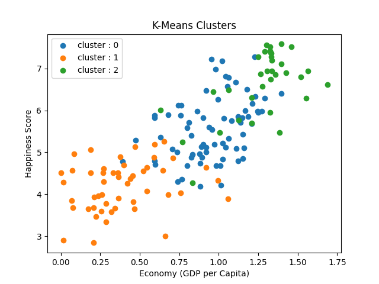

# World Happiness ML Pipeline

An end-to-end data science and machine learning workspace built using the UN World Happiness Report.

---

## 🎯 Project Overview

What truly makes a country happy? Is it purely economic wealth (GDP), or do social support, healthy life expectancy, and freedom play a bigger role? 

This project explores that exact question. Using data from the **World Happiness Report**, this pipeline transitions through the entire machine learning lifecycle—starting with exploratory data analysis, moving through multiple regression and classification techniques, and concluding with unsupervised clustering. 

### Key Objectives:
*   **Analyze:** Uncover the hidden socioeconomic drivers of global well-being.
*   **Predict:** Evaluate multiple linear, polynomial, and regularized regression models to predict continuous happiness scores.
*   **Classify & Cluster:** Segment nations into binary happiness states and discover hidden geographical groupings using unsupervised learning.
*   **Production Standards:** Demonstrate clean, enterprise-ready engineering practices by modularizing the entire workflow into **10 structured Python scripts**.

---

## 📊 Final Performance & Metrics Summary

Running the final evaluation script compiles the following benchmarking matrix directly to the console:

| Model Type | Algorithm Name | Primary Evaluation Metric | Error / Validation Metric |
| :--- | :--- | :--- | :--- |
| **Regression** | Simple Linear Regression (SLR) | R² Score: 0.6419 | MSE: 0.5080 |
| **Regression** | Multiple Linear Regression (MLR) | R² Score: 0.8283 | MSE: 0.2436 |
| **Regression** | Polynomial Regression (Degree 2) | R² Score: 0.6517 | MAE: 0.5840 \| RMSE: 0.7030 |
| **Regression** | Ridge Regression (Alpha=0.1) | R² Score: 0.8283 | MSE: 0.2436 (at Best Alpha) |
| **Classification** | Logistic Regression | Accuracy: 90.63% | F1-Score (Happy): 0.90 |
| **Classification** | Decision Tree (Depth=4) | Accuracy: 90.63% | F1-Score (Happy): 0.90 |
| **Classification** | Random Forest (100 Trees) | Accuracy: 90.63% | F1-Score (Happy): 0.90 |
| **Clustering** | K-Means Clustering (K=3) | Silhouette Score: 0.3070 | Inertia Plateau: Observed at K=3 |

### 🧠 Core Project Insights
*   **Multi-Variable Impact:** Transitioning from a single baseline feature (SLR) to the full multi-variable workflow (MLR) increased the variance explanation score ($R^2$) from **64.19% to 82.83%**, showing that global happiness relies heavily on mixed socio-economic structures rather than wealth alone.
*   **Stable Classification Boundaries:** Every classification algorithm reached an identical accuracy score of **90.63%**, indicating a highly distinct boundary separating high and low happiness states across global nations.
### Visualizing the Data Profiles


---

## 📂 Project Architecture

The core logic of this pipeline is modularly organized across the following directory files:

*   `01_eda.py` — Conducts structural checks, missing data analysis, and distribution plotting.
*   `02_simple_linear_regression.py` — Establishes a baseline continuous path mapping GDP to happiness.
*   `03_multiple_linear_regression.py` — Fits a multi-variable linear model across all scaled independent markers.
*   `04_polynomial_regression.py` — Implements degree-2 feature mapping to catch potential structural curvature.
*   `05_ridge_regression.py` — Applies L2 weight penalties across dynamic alphas to safeguard against overfitting.
*   `06_logistic_regression.py` — Targets high vs. low happiness classifications utilizing a target median boundary split.
*   `07_decision_tree.py` — Maps out binary decision sequences capped at a depth of 4 to keep routes clear and readable.
*   `08_random_forest.py` — Fits an ensemble classifier with 100 individual trees to analyze and report feature importance.
*   `09_kmeans.py` — Runs unsupervised clustering via the Elbow method to discover unique global nation profiles ($K=3$).
*   `10_model_comparison.py` — Consolidates and prints the final evaluation summary matrix shown above.
*   `world_happiness_report.csv` — The core dataset utilized by all processing modules.

---

## 🚀 How to Run the Workspace

1. **Clone the repository workspace:**
```bash
   git clone [https://github.com/YOUR_USERNAME/world-happiness-ml-pipeline.git](https://github.com/YOUR_USERNAME/world-happiness-ml-pipeline.git)
   cd world-happiness-ml-pipeline
```
2. **Execute files:**

Ensure `pandas`, `numpy`, `matplotlib`, `seaborn`, and `scikit-learn` are configured locally, then call any script directly:

```bash
python 10_model_comparison.py